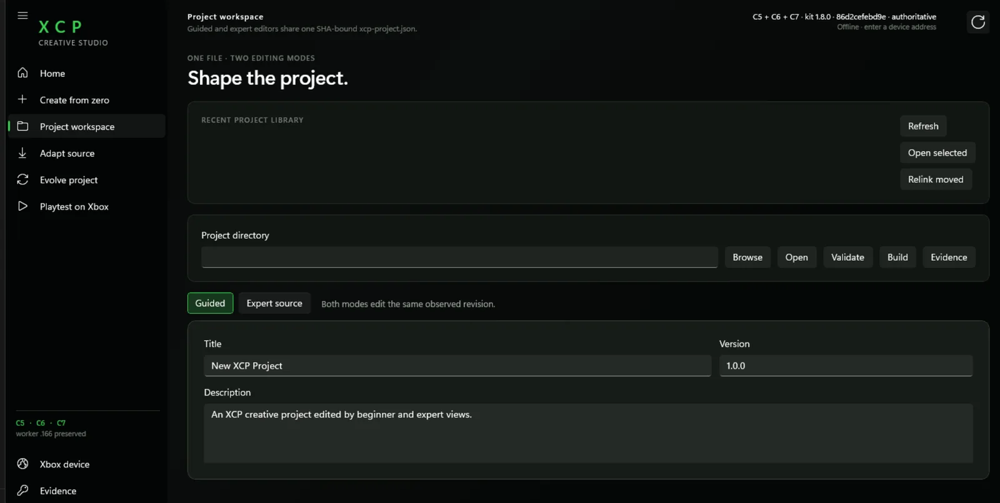
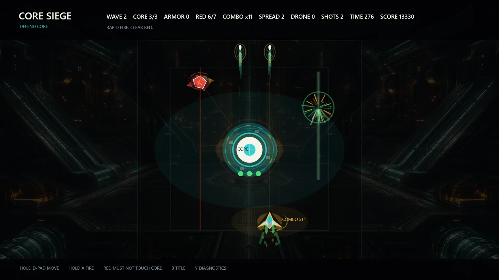
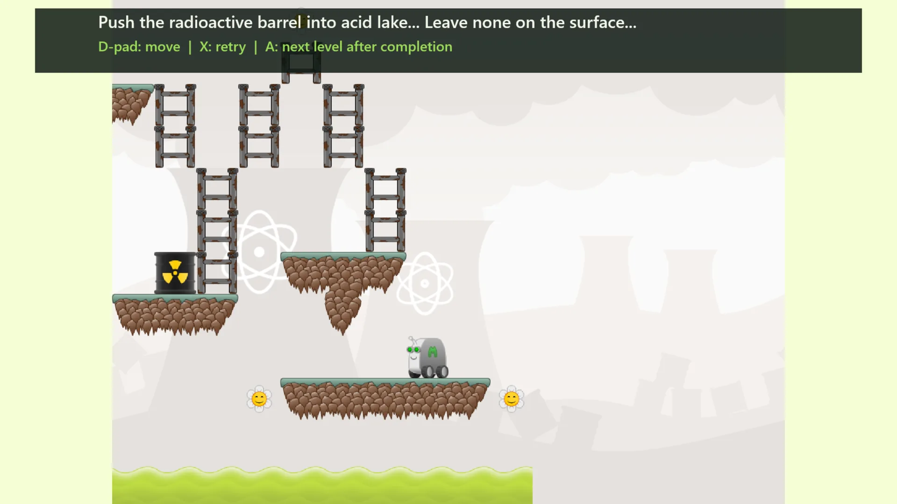
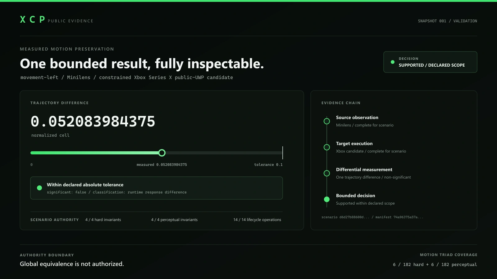

# XCP

**A programmable execution platform for Xbox Series X Developer Mode.**

XCP started from a concrete question:

> **How far can an Xbox Series X in Developer Mode be pushed as a programmable,
> deterministic computing target?**

The result is a Windows-to-Xbox development stack built around an XCP Studio on
the PC and a native XCP Worker on the console.

Studio prepares and validates projects, workloads and execution plans. The Xbox
worker admits supported work, executes it inside the UWP sandbox, and returns
structured evidence about what actually happened.

[](https://github.com/Daniele-Cangi/xcp-xbox/actions/workflows/tests.yml)
[](https://github.com/Daniele-Cangi/xcp-xbox/actions/workflows/codeql.yml)
[](LICENSE)
[](pyproject.toml)

---

## What XCP does

The practical path looks like this:

```text
Windows PC
┌──────────────────────────────┐
│          XCP Studio          │
│                              │
│  project / workload          │
│  adaptation                  │
│  validation                  │
│  capability planning         │
└──────────────┬───────────────┘
               │
               │ admitted package / execution request
               ▼
Xbox Series X — Developer Mode
┌──────────────────────────────┐
│          XCP Worker          │
│                              │
│  CPU execution               │
│  GPU execution               │
│  XVM                         │
│  storage / state             │
│  observation                 │
└──────────────┬───────────────┘
               │
               │ result + evidence
               ▼
┌──────────────────────────────┐
│      verification layer      │
│                              │
│  what executed?              │
│  what matched?               │
│  what diverged?              │
│  what was never proved?      │
└──────────────────────────────┘
```

XCP is not an emulator. It is a development and execution system built around
the capabilities available to an Xbox app in Developer Mode.

## Agent-native development

XCP was designed so human developers and coding agents can operate the same
project format and the same bounded lifecycle.

An agent can work from the PC or another external service to discover runtime
capabilities, author intent, create or adapt projects, validate and build
artifacts, submit admitted work, inspect structured errors, and consume
machine-readable results and evidence.

```text
Developer / Coding Agent
          │
          │ create · adapt · evolve · build · verify
          ▼
 XCP Studio / Agent Toolchain
          │
          │ project intent + admitted plan
          ▼
      XCP Worker
    Xbox Series X
          │
     CPU / GPU / XVM
          │
          ▼
 canonical result + evidence
          │
          └──────────────► inspect · correct · iterate
```

The agent is a **controller**, not an unrestricted payload running on the
console. The Xbox side exposes bounded, versioned execution surfaces and keeps
model credentials off-device. The preserved worker SDK contract places the
controller on an external PC or service and records that Codex itself does not
run on Xbox.

The reference tree already contains agent-native project creation, source
adaptation, correction-ledger and lifecycle contracts, plus an agent-native XVM
toolchain path. Historical reference evidence includes an Xbox-measured
agent-native XVM toolchain; the current reconstructed development packages
remain `NOT_TESTED_ON_XBOX` until independently reproduced.

XCP is not tied to one model provider. Codex-oriented tooling exists in the
preserved reference lineage, but other coding agents can use the same contracts.
There is **no native MCP server claim today**; an MCP adapter is a natural
community extension rather than an implied existing feature.

See [Agent-native architecture](docs/AGENT_NATIVE.md).

## This already ran on a physical Xbox

XCP is not a paper architecture.

The preserved **P4/r10** product path was exercised on a physical Xbox Series X:

- XCP Studio ran on Windows;
- the signed worker package was installed on Xbox;
- Studio discovered and validated the target path;
- a project was built and prepared from Studio;
- the one-click preview path delegated work to the Xbox worker;
- the console activated and launched the result;
- execution and observation completed through the bounded XCP path.

That measured P4/r10 path remains the historical Xbox reference.

The source in this repository can rebuild a new development distribution from
source, including Studio, the native worker and supporting runtime components.
Those reconstructed packages use separate development identities and have
**not yet been revalidated on Xbox**, so they remain explicitly:

```text
NOT_TESTED_ON_XBOX
```

The distinction is intentional: historical evidence is not silently reused as
evidence for a new build.

## Recorded public visuals

These are unchanged public visuals from
[XCP-Research at commit `84c6c742`](https://github.com/Daniele-Cangi/XCP-Research/tree/84c6c742afc2b9a8e51450dc2081e848814bc724).
Their [byte-level provenance](provenance/visual-asset-provenance.json) is recorded
separately from the reconstructed source. They show recorded scenarios and
product surfaces. They do not identify every depicted scenario as P4/r10 or
validate the new development packages on Xbox.

### XCP Studio workspace



This is a real Studio product surface for project work.

### Core Siege



Core Siege is a real capture of software produced through the AI-driven
workflow, not an AI-generated marketing image. It illustrates the recorded
creation scenario, not a general success claim for new projects.

### Minilens adaptation



This is a real capture of the authorized adaptation case. Minilens remains the
work of its authors under GPL-3.0-or-later. The public result concerns a
playable behavioural subset with declared degradation; full source equivalence
is not claimed.

### Evidence surface



This is a real product surface showing a bounded result for the declared
`movement-left` scenario and its frozen tolerance. It does not establish global
equivalence. The [validation overview](assets/xcp-studio-validation-overview.svg)
is an explanatory diagram, and the
[social preview](assets/social-preview/xcp-research-github-social-preview.png)
is a visual summary; neither is a new execution record.

## What is inside XCP

### XCP Studio

A Windows WinUI development environment that drives the project workflow:
create, open, validate, build, verify and prepare execution.

### XCP Worker

The native UWP runtime designed for Xbox Developer Mode. It contains the
bounded execution surfaces, runtime admission, result handling and observation
logic used by the product path.

### CPU Capsule

A separately packaged native CPU execution component used by worker runtime
paths that require the capsule ABI.

### GPU runtime

The reference worker contains Direct3D compute paths and precompiled HLSL
workloads, including XVM GPU execution surfaces and differential CPU/GPU
infrastructure.

### XVM

XCP's bounded programmable virtual machine.

The repository includes the XVM v2 ISA, assembler, verifier, deterministic CPU
reference interpreter, fuel analysis, typed memory, structured control and
snapshot semantics.

XVM can also be exercised independently on a PC.

### Project adaptation

XCP can observe software projects before lowering them to a target.

Godot is currently the first concrete source adapter. The public adapter handles
a structural Godot 4 subset and binds its semantic records to exact source
bytes.

It does **not** claim that arbitrary Godot projects or GDScript behavior are
already translated automatically.

### Evidence and provenance

XCP treats execution evidence as part of the product, not as an afterthought.

Source, project, plan, target profile, execution and result identities can be
bound explicitly. Execution success and fidelity are separate decisions.

That means:

> **"It ran" is not the same claim as "it was preserved correctly."**

## Why the architecture became broader than Xbox

XCP was built for Xbox first.

While building it, the system naturally separated into reusable layers:

```text
exact source
    ↓
Source Observation
    ↓
Source Model
    ↓
Semantic IR
    ↓
Capability admission
    ↓
Target lowering
    ↓
Execution
    ↓
Observation
    ↓
Differential evidence
```

That separation makes the architecture extensible beyond Xbox without changing
its origin.

The Xbox implementation is the first real target and the reason the platform
exists. Other source adapters and targets can be added around the same
contracts.

## Build status

The repository can build the complete development stack on Windows from a
verified source-only snapshot with no `.git` directory.

The integrated build produces:

- XCP Studio / WinUI;
- pinned application-local Python;
- the XCP product toolchain;
- XCP Worker;
- native module;
- topology broker;
- CPU Capsule;
- development-signed MSIX packages;
- a first-party sample project;
- provenance and verification manifests.

The build then extracts the generated distribution again, verifies the file
manifest and hashes, and exercises the PC project workflow from the extracted
files.

The current public source therefore proves the **PC reconstruction path**. A new
Xbox device attempt is a separate hardware gate.

## Quick start

The portable parts can be exercised on any supported Python development
environment:

```bash
git clone https://github.com/Daniele-Cangi/xcp-xbox.git
cd xcp-xbox

python -m pip install -e '.[test]'
python -m pytest -q
xcp conformance all
```

Run an XVM artifact:

```bash
xcp xvm verify src/xcp/conformance/vectors/xvm-v2-call-chain.json
xcp xvm run src/xcp/conformance/vectors/xvm-v2-call-chain.json
```

Inspect the project contract:

```bash
xcp project describe
```

The CLI also exposes deterministic `create`, `validate`, `build` and
`verify` project operations.

## Build the full Windows + Xbox development stack

Requirements:

- Windows;
- Visual Studio with MSVC **v145**;
- Windows SDK with MakeAppx, SignTool and VCLibs;
- .NET 8;
- Python 3.12 for the build host.

Run:

```powershell
New-Item -ItemType Directory -Force build | Out-Null
& tools/build_development_distribution.ps1 -OutputRoot build/development-run
```

The build:

1. verifies the preserved reference source graph;
2. stages new development package identities;
3. builds the worker, native module, broker and CPU Capsule;
4. creates a fresh local development signing identity;
5. builds and publishes Studio;
6. builds the pinned Python runtime;
7. assembles the development distribution;
8. extracts it again;
9. verifies all listed files and hashes;
10. exercises the PC project workflow from the extracted distribution.

No private signing key is shipped.

See [Development distribution](docs/DEVELOPMENT_DISTRIBUTION.md) for the exact
toolchain, licensing and evidence boundary.

## Reproducing on Xbox

A contributor with an Xbox Series X in Developer Mode can attempt the new
development packages using the prepared protocol:

[Community Xbox reproduction protocol](docs/COMMUNITY_XBOX_REPRODUCTION.md)

A new device run must report its own build and package identities. It does not
inherit the historical P4/r10 result automatically.

## What XCP is not

XCP is not:

- an Xbox emulator;
- a jailbreak or sandbox escape;
- an arbitrary native-code upload mechanism;
- a claim of unrestricted access to Xbox hardware;
- a claim that every Godot project can already be converted automatically;
- a system that treats launch success as proof of behavioral equivalence.

The runtime stays inside the supported Xbox app sandbox and exposes bounded,
admitted execution surfaces.

## Repository map

```text
src/xcp/                     portable XCP contracts, evidence and XVM
reference/xcompute-probe/    preserved product reference implementation
tools/                       build, packaging, provenance and verification
tests/                       portable and reconstruction tests
examples/                    synthetic first-party examples
provenance/                  source and reconstruction identity records
docs/                        architecture, claims, build and hardware guides
```

The preserved reference source is intentional: XCP can compare new work against
known implementation bytes instead of reconstructing the product from prose.

## Deeper architecture

The core keeps source meaning separate from target mechanics.

An authored project intent records acceptance criteria before execution.
Adapters describe source semantics. Targets publish capabilities. Admission
decides whether the requested work is supported. Evidence is bound to the exact
identities involved in the run.

This is the rule that emerged from the Xbox work:

> **A claim can never be stronger than the evidence bound to it.**

Useful technical entry points:

- [Architecture](docs/ARCHITECTURE.md)
- [Claim model](docs/CLAIM_MODEL.md)
- [Conformance](docs/CONFORMANCE.md)
- [Reference XVM](docs/REFERENCE_XVM.md)
- [Reference Studio](docs/REFERENCE_STUDIO.md)
- [Reference worker](docs/REFERENCE_WORKER.md)
- [Agent-native architecture](docs/AGENT_NATIVE.md)
- [Provenance](docs/PROVENANCE.md)
- [Reconstruction audit](docs/RECONSTRUCTION_AUDIT.md)

## Contributing

The most useful contribution paths are concrete:

- reproduce the development stack on another Windows machine;
- attempt the new worker on an owned Xbox in Developer Mode;
- add XVM conformance implementations;
- extend the Godot source adapter;
- add a new source adapter;
- explore a new target while keeping the same admission and evidence model;
- improve Studio, diagnostics, packaging or verification;
- connect another coding-agent framework to the existing agent lifecycle;
- build an MCP adapter without bypassing XCP admission or evidence contracts.

See [ROADMAP.md](ROADMAP.md) and [CONTRIBUTING.md](CONTRIBUTING.md).

## License

XCP first-party source is licensed under the
[Apache License 2.0](LICENSE).

Third-party dependencies and redistributed components remain under their own
terms. See [NOTICE](NOTICE) and the development distribution documentation.
